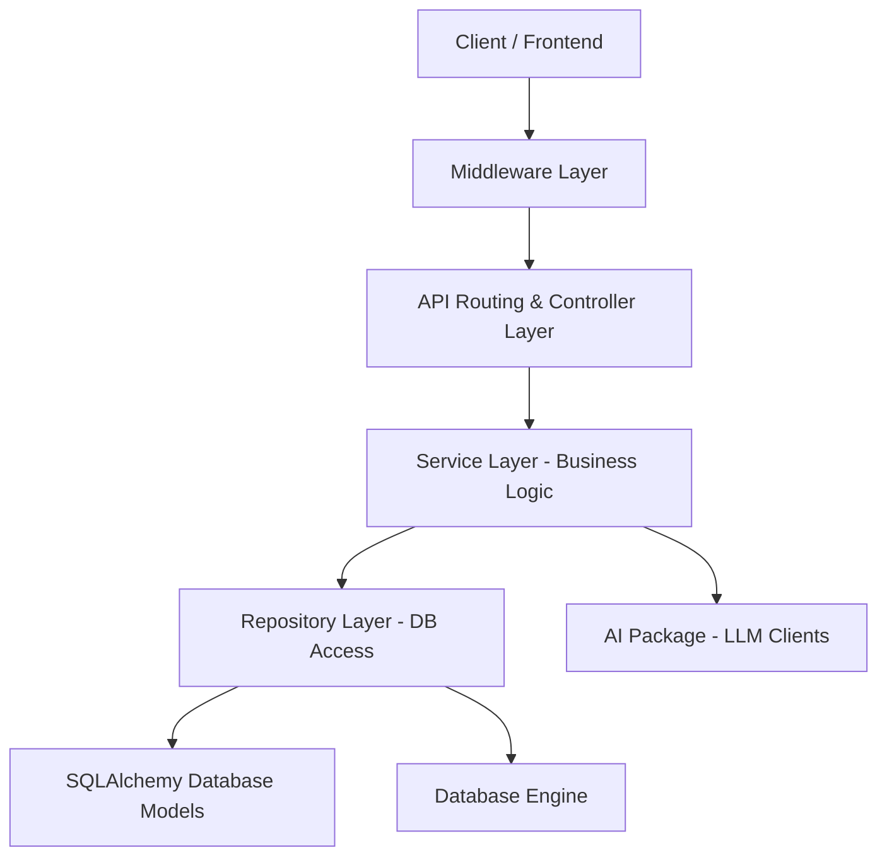

# CodeInsight AI Architecture Guide

This document describes the design patterns, package layers, and data flow of **CodeInsight AI**.

## Design Philosophy
We follow a strict **Layered Architecture** style on the backend to enforce separation of concerns, improve testability, and keep the application maintainable as features scale.

## Backend Architecture Layers

### 1. `app/config/`
* **Purpose**: Application-wide settings management.
* **Technology**: Uses Pydantic-Settings to validate environment variables from `.env`.
* **Rules**: Always read settings from this package; never read directly from `os.environ` elsewhere.

### 2. `app/middleware/`
* **Purpose**: Cross-cutting concerns such as logging, security headers, request tracing, and CORS.
* **Rules**: Intercepts requests/responses globally. Keep execution logic lightweight to avoid slowing down API throughput.

### 3. `app/api/`
* **Purpose**: Entry points for HTTP requests (FastAPI routers).
* **Rules**: Handles status codes, handles route parameters, depends on the service layer, and performs validation via Pydantic Schemas. Avoid writing queries or business logic here.

### 4. `app/schemas/`
* **Purpose**: Data transfer objects (DTOs) for request validation and response serialization.
* **Technology**: Pydantic models.
* **Rules**: Do not mix db model logic here. Keep definitions strictly for API inputs and outputs.

### 5. `app/services/`
* **Purpose**: Implements core business logic.
* **Rules**: Orchestrates repositories, triggers AI analyzers, checks user permissions, and governs transactional logic.

### 6. `app/repositories/`
* **Purpose**: Encapsulates all database query logic (CRUD).
* **Technology**: SQLAlchemy 2.0 Select statements.
* **Rules**: Direct database operations belong here. No database queries should leak into the service layer or controllers.

### 7. `app/models/`
* **Purpose**: Database schema definition.
* **Technology**: SQLAlchemy Declarative Mapping.
* **Rules**: All models must inherit from `app.models.base.Base`.

### 8. `app/ai/`
* **Purpose**: Interface for LLM clients (OpenAI, Anthropic, Gemini).
* **Rules**: All model integrations must implement the `BaseAIClient` interface to ensure pluggability.

### 9. `app/utils/`
* **Purpose**: Pure, stateless helper functions (e.g., date formats, math calculations).
