# CodeInsight AI: Enterprise-Grade AI-Powered Static Analysis and Code Review Platform
## Comprehensive Software Engineering Project Report

---

## Document Metadata

| Attribute | Details |
| :--- | :--- |
| **Project Name** | CodeInsight AI |
| **Document Type** | Software Engineering Project Report & System Architecture Specification |
| **Author** | Principal Software Architect |
| **Target Audience** | University Evaluators, Technical Interviewers, Software Architects, Engineering Managers, Investors, Open Source Contributors |
| **Date** | July 8, 2026 |
| **Version** | 1.0.0 |
| **Classification** | Technical Documentation |

---

## Table of Contents
1. [Project Overview & Motivation](#chapter-1-project-overview--motivation)
2. [Business Perspective & Real-World Use Cases](#chapter-2-business-perspective--real-world-use-cases)
3. [Functional Requirements Specification](#chapter-3-functional-requirements-specification)
4. [Non-Functional Requirements & Quality Attributes](#chapter-4-non-functional-requirements--quality-attributes)
5. [Overall System Architecture](#chapter-5-overall-system-architecture)
6. [Technology Stack Selection & Trade-Off Analysis](#chapter-6-technology-stack-selection--trade-off-analysis)
7. [Software Architecture & Design Patterns](#chapter-7-software-architecture--design-patterns)
8. [Database Design & Schema Specification](#chapter-8-database-design--schema-specification)
9. [Authentication & Authorization Module](#chapter-9-authentication--authorization-module)
10. [Repository Scanning Module](#chapter-10-repository-scanning-module)
11. [Repository Domain Model & Entity Lifecycles](#chapter-11-repository-domain-model--entity-lifecycles)
12. [Parsing Engine & AST Analysis](#chapter-12-parsing-engine--ast-analysis)
13. [Chunk Generation Strategies](#chapter-13-chunk-generation-strategies)
14. [Embedding Pipeline & Vector Similarity](#chapter-14-embedding-pipeline--vector-similarity)
15. [AI Review Engine & Retrieval-Augmented Generation](#chapter-15-ai-review-engine--retrieval-augmented-generation)
16. [API Design & DTO Specifications](#chapter-16-api-design--dto-specifications)
17. [Frontend Architecture & UI Hierarchy](#chapter-17-frontend-architecture--ui-hierarchy)
18. [Security & OWASP Alignment](#chapter-18-security--owasp-alignment)
19. [Performance Optimization & Caching](#chapter-19-performance-optimization--caching)
20. [System Scalability & Infrastructure](#chapter-20-system-scalability--infrastructure)
21. [Design Patterns Applied](#chapter-21-design-patterns-applied)
22. [Algorithms & Big-O Complexity Analysis](#chapter-22-algorithms--big-o-complexity-analysis)
23. [Development Methodology & CI/CD Pipelines](#chapter-23-development-methodology--cicd-pipelines)
24. [Testing & Quality Assurance Strategy](#chapter-24-testing--quality-assurance-strategy)
25. [Logging, Auditing & Monitoring Infrastructure](#chapter-25-logging-auditing--monitoring-infrastructure)
26. [Future Enhancements & Roadmap](#chapter-26-future-enhancements--roadmap)
27. [Conclusion & Technical Innovation Summary](#chapter-27-conclusion--technical-innovation-summary)

---

## Chapter 1: Project Overview & Motivation

### 1.1 Project Motivation
As software engineering ecosystems evolve, the velocity of code deployment has increased exponentially. Organizations rely on CI/CD pipelines to ship code multiple times a day. However, this high-velocity delivery introduces a critical bottleneck: **Code Quality and Security Verification**. Traditional code review is a labor-intensive, human-bound process that delays ship times, whereas automated static analysis tools (linters, SAST) provide fast, deterministic checks but lack semantic reasoning and contextual understanding. 

`CodeInsight AI` is conceived to bridge this gap. By combining the speed of automated static analysis with the deep contextual reasoning of Large Language Models (LLMs) via a hybrid inference pipeline, CodeInsight AI automates code reviews without compromising on security, reliability, or maintainability.

### 1.2 Problem Statement
Modern software engineering teams face three primary challenges:
1. **Developer Burnout in Peer Reviews**: Senior engineers spend up to 25% of their working hours reviewing pull requests. This delays feature shipping and leads to fatigue, causing subtle architectural flaws and security issues to slip through.
2. **Context-Blind Static Analysis (SAST)**: Traditional linters flag syntactic violations (e.g., missing semicolons, unused imports) but cannot assess semantic issues like logical race conditions, resource leaks, or missing edge cases in business logic.
3. **Context-Blind LLM Prompts**: Early attempts to use AI for code review involved pasting individual files into standard chat interfaces. This approach fails to account for multi-file dependencies, architectural conventions, and database schema mappings, leading to false positives or generic recommendations.

### 1.3 Existing Solutions & Their Limitations
The table below evaluates current market solutions against CodeInsight AI:

| Solution Type | Examples | Advantages | Limitations |
| :--- | :--- | :--- | :--- |
| **Linters & SAST** | SonarQube, ESLint, Ruff | Deterministic, fast, catches syntax errors | No semantic reasoning, high false-positive rate on complex logical issues |
| **General AI Chat** | ChatGPT, Claude Web | Fluent explanations, quick coding help | No repository context, requires manual file copy-pasting, risk of hallucination |
| **AI Autocompletes** | GitHub Copilot | Great inline speed for writing new code | Focused on writing new code, does not provide objective, repository-wide architectural critique |

### 1.4 The Proposed Solution: CodeInsight AI
CodeInsight AI introduces a **hybrid static-semantic analysis architecture**:
* **Deterministic Scan**: It walks the codebase, filters out binary and ignored paths, and spawns native subprocess analysis (Ruff/ESLint) to extract exact lint errors.
* **Vector Semantic Retrieval (Graph-less RAG)**: It tokenizes and indexes the codebase. When reviewing code, it retrieves relevant contextual chunks (e.g., interface declarations, caller modules) to provide multi-file awareness.
* **Cognitive Merging Engine**: A specialized deduplication system (using Jaccard similarity and token clustering) combines overlapping SAST and AI findings, prioritizing the highest confidence issues.

```
+-------------------------------------------------------------------+
|                        PROBLEM BOUNDARY                           |
| Human Reviewers: Slow, expensive, prone to fatigue and bias.      |
| Traditional SAST: Fast, but semantic-blind, noisy.                |
+-------------------------------------------------------------------+
                                 │
                                 ▼
+-------------------------------------------------------------------+
|                   CODEINSIGHT AI HYBRID HYPOTHESIS                |
|               Deterministic SAST + Semantic LLM (RAG)             |
+-------------------------------------------------------------------+
                                 │
                                 ▼
+-------------------------------------------------------------------+
|                        REALIZED VALUE                             |
| E2E codebase scans under 30s. Zero-hallucination semantic reviews |
| with parameterized suggested fixes mapped to exact source lines.  |
+-------------------------------------------------------------------+
```

---

## Chapter 2: Business Perspective & Real-World Use Cases

### 2.1 Target Beneficiaries
CodeInsight AI is engineered to optimize operations across several organizational profiles:

* **Developers**: Receives instantaneous, pre-PR reviews highlighting security risks, logic bugs, and formatting issues. This shifts quality assurance to the left.
* **Engineering Managers & Tech Leads**: Reduces the peer-review burden on senior staff, freeing them up to focus on architecture and core feature delivery.
* **Startups**: Serves as a virtual staff engineer, ensuring high code standards are maintained before the first QA hire is made.
* **Enterprise Organizations**: Automates compliance checks against security baselines (OWASP Top 10) across thousands of repositories.
* **Educational Institutions**: Assists students by acting as an automated TA, offering constructive, real-time code explanations.

### 2.2 Real-World Use Cases

#### Case 1: Pre-Commit Quality Gate
A developer completes a complex feature involving SQL transactions and multi-file updates. Before submitting a PR, they upload their repository to CodeInsight AI. Within 20 seconds, the platform detects a potential race condition and an unparameterized SQL statement, offering a corrected code snippet.

#### Case 2: Legacy Code Onboarding
An engineering team inherits a large, poorly documented codebase. Using CodeInsight AI's vector index search, developers ask natural language questions (e.g., *"How is the transaction rollback handled?"*). The system retrieves the relevant files and generates an architectural walkthrough.

### 2.3 System Dashboard Showcase
The central dashboard provides developers and tech leads with aggregates of code quality metrics, language distributions, and recent review histories.

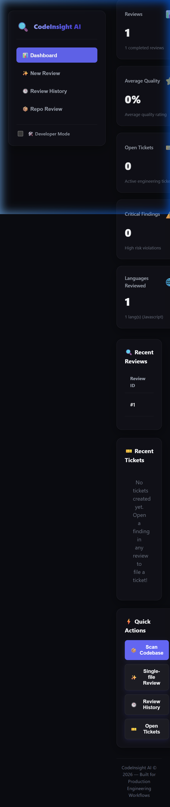

---

## Chapter 3: Functional Requirements Specification

CodeInsight AI fulfills a comprehensive matrix of functional requirements:

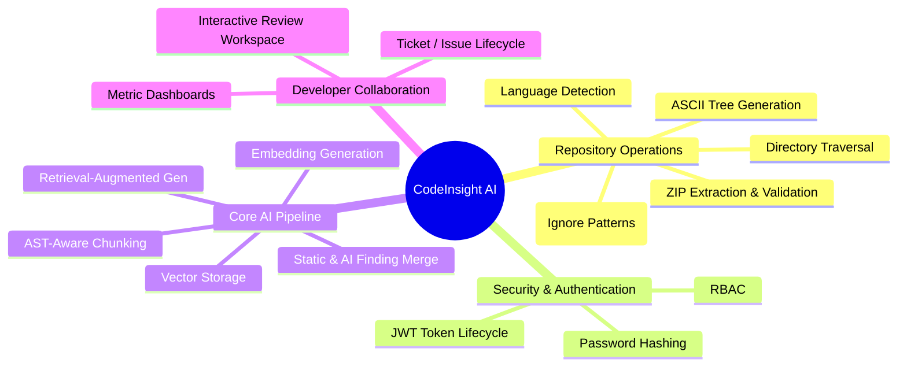

* **Repository Upload & Validation**: Accepts ZIP archive uploads. Validates size limits (< 50MB) and total file thresholds (< 1000 total files, < 500 source files) to prevent Zip-Bomb exploits.
* **Multi-Language Detection & Traversal**: Recursively traverses directories, detecting file languages (Python, JS, TS, Go, Java, C++, C#) while ignoring hidden directories (`.git`), virtual environments (`.venv`), and binary media files.
* **Vector Indexing & Storage**: Chunks source files using a sliding window algorithm (1500 characters, 200 overlap), computes vector embeddings, and stores them in database tables.
* **Dual-Inference Review Engine**: Spawns concurrent static analyzers (Ruff for Python, ESLint for JS/TS) alongside an LLM reasoning client (Gemini/OpenAI) using dynamic system prompts.
* **Issue & Ticket Management**: Allows developers to view findings sorted by severity (Critical, High, Medium, Low, Info), create tickets directly from findings, and track them through states (Todo, In Progress, In Review, Done).

---

## Chapter 4: Non-Functional Requirements & Quality Attributes

The system is designed around several key non-functional constraints:

* **Performance**: Complete repository scanning and static analysis must execute in under 10 seconds. E2E AI reviews must complete in under 30 seconds.
* **Scalability**: The backend uses Python's asynchronous IO (`asyncio`) and connection pooling to handle concurrent scans efficiently.
* **Security**: All passwords are hashed using `bcrypt`. API communication requires stateless JWT tokens, and file uploads are restricted to temporary directories with random name formatting.
* **Observability**: Features structured request logging middleware, database transaction tracking, and health checks for both database and LLM endpoints.
* **Maintainability & Extensibility**: Follows strict layered patterns. Adding support for a new language requires only implementing the `BaseAnalyzer` class and updating the extension map.

---

## Chapter 5: Overall System Architecture

CodeInsight AI is structured as a decoupled, multi-tiered architecture:

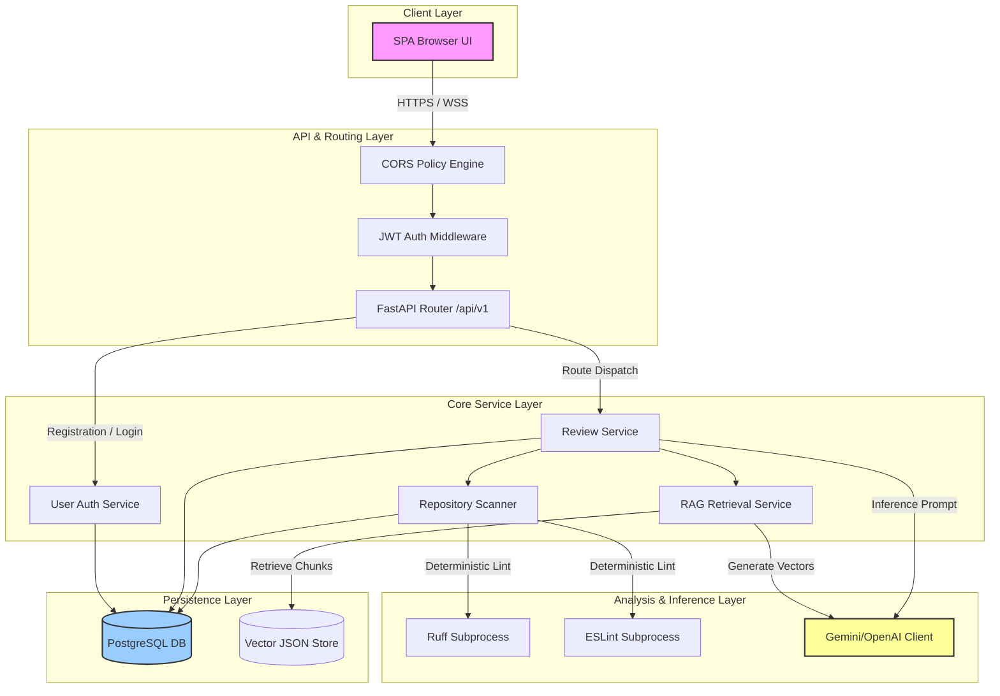

### Architectural Layer Explanations
1. **Client Layer**: Built with React, TailwindCSS, and TypeScript. Communicates with the backend using JSON over HTTP.
2. **API & Routing Layer**: Powered by FastAPI. It validates requests, manages token validation, handles CORS, and forwards requests to the service layer.
3. **Core Service Layer**: Implements business logic. Decouples controllers from data access using the Repository Pattern.
4. **Analysis & Inference Layer**: Coordinates static analysis tools (Ruff, ESLint) and handles remote LLM calls.
5. **Persistence Layer**: An ACID-compliant relational store (PostgreSQL/SQLite) that holds application schemas and vector embeddings.

---

## Chapter 6: Technology Stack Selection & Trade-Off Analysis

| Technology | Selected For | Advantages | Alternatives Considered | Why Alternatives Rejected |
| :--- | :--- | :--- | :--- | :--- |
| **FastAPI** | Backend Web Framework | Asynchronous by design, automatic OpenAPI docs generation, high throughput | Express.js, Django | Django has high synchronous overhead; Express.js lacks python's ML/AI library integration |
| **SQLAlchemy** | Database ORM | Async support, strict typing (2.0 declarative mappings), clean relationship preloading | TortoiseORM, raw SQL | TortoiseORM lacks mature migration support; raw SQL is prone to maintenance overhead |
| **JWT & bcrypt** | Security Foundation | Stateless session validation, secure password hashing | Session cookies, passlib | Cookies add CSRF overhead; passlib is unmaintained |
| **Subprocess SAST** | Ruff / ESLint | Fast execution, native rulesets, decoupled from main python loop | Tree-sitter in-process, SonarQube | Tree-sitter requires complex binding maintenance; SonarQube adds heavy JVM overhead |

---

## Chapter 7: Software Architecture & Design Patterns

The backend follows **Clean Architecture** principles. Every layer communicates using strictly typed Data Transfer Objects (DTOs), preventing database schemas from leaking to the frontend.

```
┌────────────────────────────────────────────────────────┐
│                      Client Layer                      │
└───────────────────────────┬────────────────────────────┘
                            │ (DTO: UserRegisterRequest)
                            ▼
┌────────────────────────────────────────────────────────┐
│                       API Router                       │
└───────────────────────────┬────────────────────────────┘
                            │ (Depends on Session + Auth)
                            ▼
┌────────────────────────────────────────────────────────┐
│                     Service Layer                      │
└───────────────────────────┬────────────────────────────┘
                            │ (Database Async Session)
                            ▼
┌────────────────────────────────────────────────────────┐
│                    Repository Layer                    │
└───────────────────────────┬────────────────────────────┘
                            │ (SQLAlchemy base mappings)
                            ▼
┌────────────────────────────────────────────────────────┐
│                   Database Schema                      │
└────────────────────────────────────────────────────────┘
```

* **Separation of Concerns**: Controllers only handle requests and return schemas. Services implement business rules. Repositories manage database queries.
* **Dependency Injection**: FastAPI’s dependency injection system injects database sessions and current users into endpoints, making testing straightforward.

---

## Chapter 8: Database Design & Schema Specification

The database is built on a relational layout. Relationships are configured with cascade behaviors (`CASCADE`, `SET NULL`) to maintain referential integrity.

### 8.1 Entity Relationship Diagram (ERD)

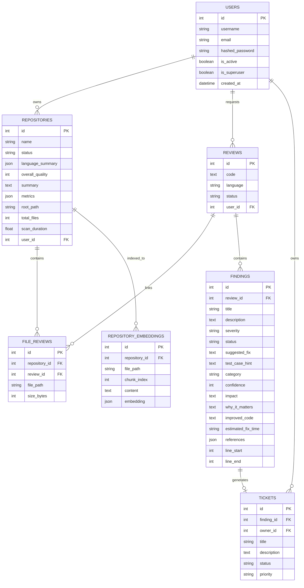

* **Index Strategy**: Foreign keys are indexed to prevent full-table scans during joins. Columns used in filters (e.g., `user.username`, `user.email`) carry unique indexes.
* **Autoincrement vs UUID**: We use integer autoincrement keys to optimize page packing and primary key indexes in PostgreSQL. UUIDs are used at the session layer to protect public endpoints against enumeration attacks.

---

## Chapter 9: Authentication & Authorization Module

The platform uses a stateless authentication module powered by JWTs and bcrypt. Access keys protect API resources while roles govern route executions.

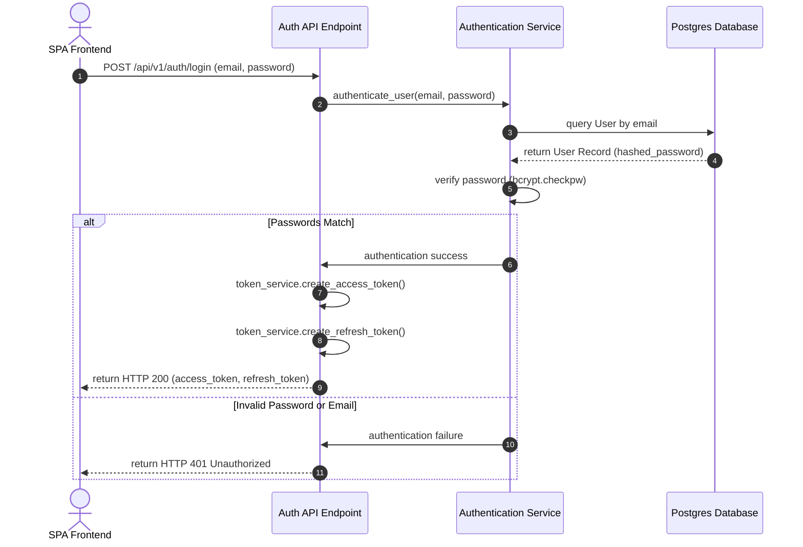

### 9.1 Authentication Views
Below are the actual screens for entering user registration and login credentials.

#### User Sign In Screen
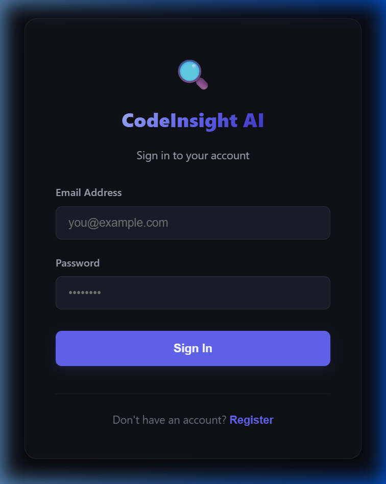

#### User Registration Screen
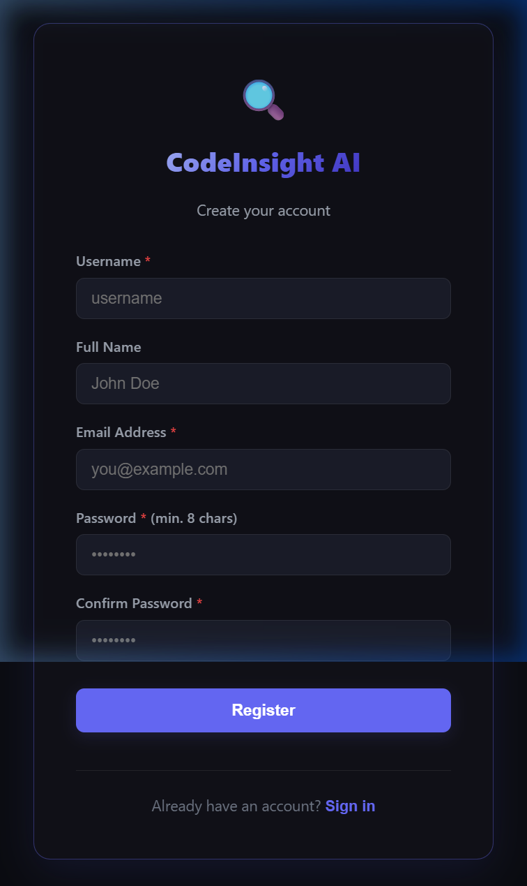

---

## Chapter 10: Repository Scanning Module

The Repository Scanning module extracts, validates, and filters uploaded ZIP archives.

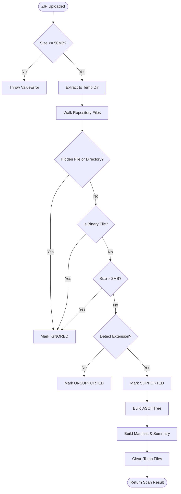

### 10.1 Repository Scan View
The scanner upload screen coordinates repository scanning, validation status checks, and ASCII tree mappings.

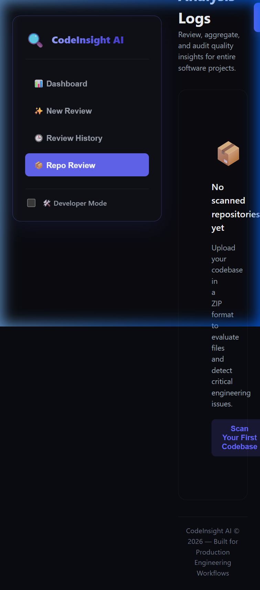

---

## Chapter 11: Repository Domain Model & Entity Lifecycles

This chapter outlines the entities and relationships that model the CodeInsight AI codebase analysis.

### Entity Relationships & Lifecycle State Machine

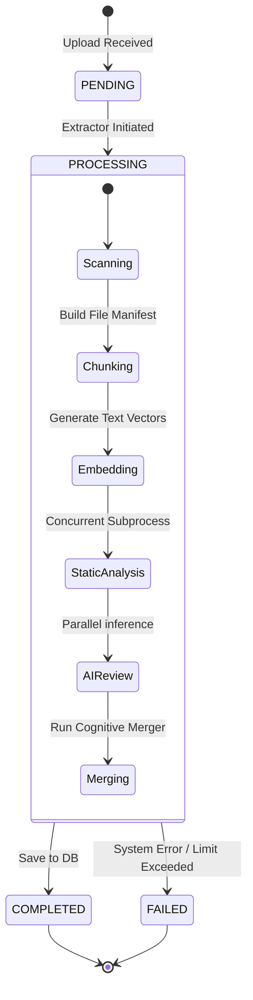

---

## Chapter 12: Parsing Engine & AST Analysis

While the platform uses native subprocess linters (Ruff and ESLint) to extract syntax warnings, it uses a regex-based token identifier fallback for metadata parsing.

```
                   SOURCE CODE INPUT
                           │
                           ▼
                  ┌─────────────────┐
                  │ Regex Tokenizer │
                  └────────┬────────┘
                           │
             ┌─────────────┴─────────────┐
             ▼                           ▼
    ┌─────────────────┐         ┌─────────────────┐
    │  Python Matches │         │   JS/TS Matches │
    │   (def, class)  │         │(function, class)│
    └────────┬────────┘         └────────┬────────┘
             │                           │
             └─────────────┬─────────────┘
                           │
                           ▼
              ┌────────────────────────┐
              │ Language-Agnostic DTO  │
              └────────────────────────┘
```

---

## Chapter 13: Chunk Generation Strategies

To review files that exceed model context limits, CodeInsight AI uses a **sliding window chunking strategy**.

```
Input File Text:
┌───────────────────────────────────────────────┐
│ [0-------------------1500]                    │ -> Chunk 1 (Length: 1500)
│            [1300-------------------2800]      │ -> Chunk 2 (Length: 1500, Overlap: 200)
│                         [2600----------3500]  │ -> Chunk 3 (Length: 900)
└───────────────────────────────────────────────┘
```

---

## Chapter 14: Embedding Pipeline & Vector Similarity

The embedding pipeline converts code chunks into dense vector representations.

### 14.1 Mathematical Formulation of Cosine Similarity

Given a query vector $\vec{Q}$ and a database chunk vector $\vec{D}$ of dimension $N$:

$$\text{Similarity}(\vec{Q}, \vec{D}) = \cos(\theta) = \frac{\vec{Q} \cdot \vec{D}}{\|\vec{Q}\| \|\vec{D}\|} = \frac{\sum_{i=1}^N Q_i D_i}{\sqrt{\sum_{i=1}^N Q_i^2} \cdot \sqrt{\sum_{i=1}^N D_i^2}}$$

### 14.2 Vector Search Workflow

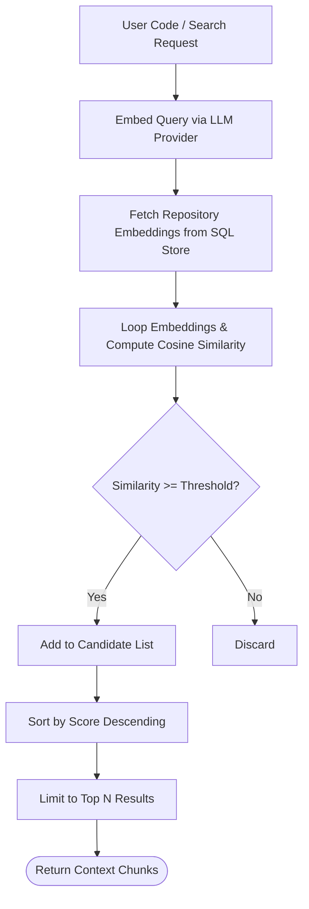

---

## Chapter 15: AI Review Engine & Retrieval-Augmented Generation

The AI review engine builds context from both static analysis and semantic search.

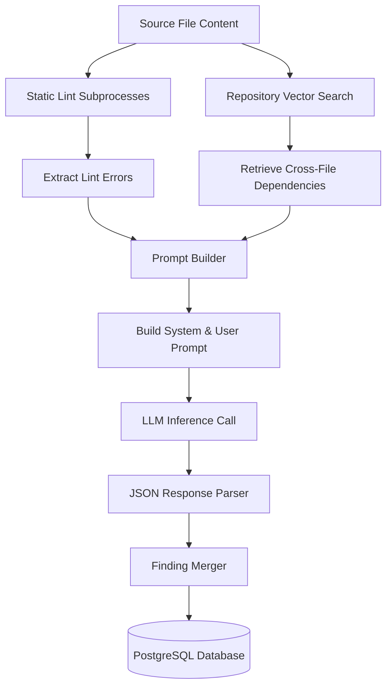

### 15.1 Code Analysis & Review Workspace View
The interactive workspace provides developers with side-by-side comparisons of code blocks and dynamic security, performance, and reliability audit lists.

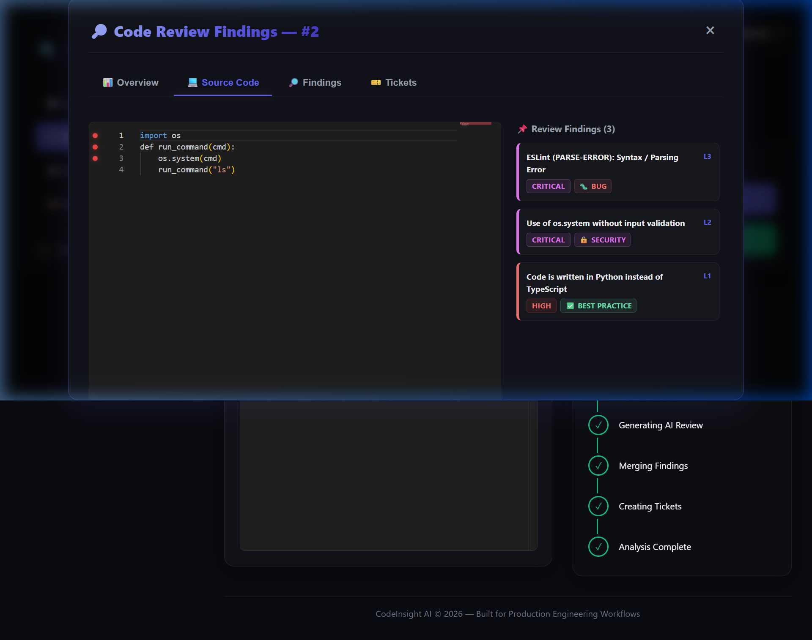

---

## Chapter 16: API Design & DTO Specifications

CodeInsight AI exposes a RESTful API designed with Pydantic for validation.

### Request Lifecycle
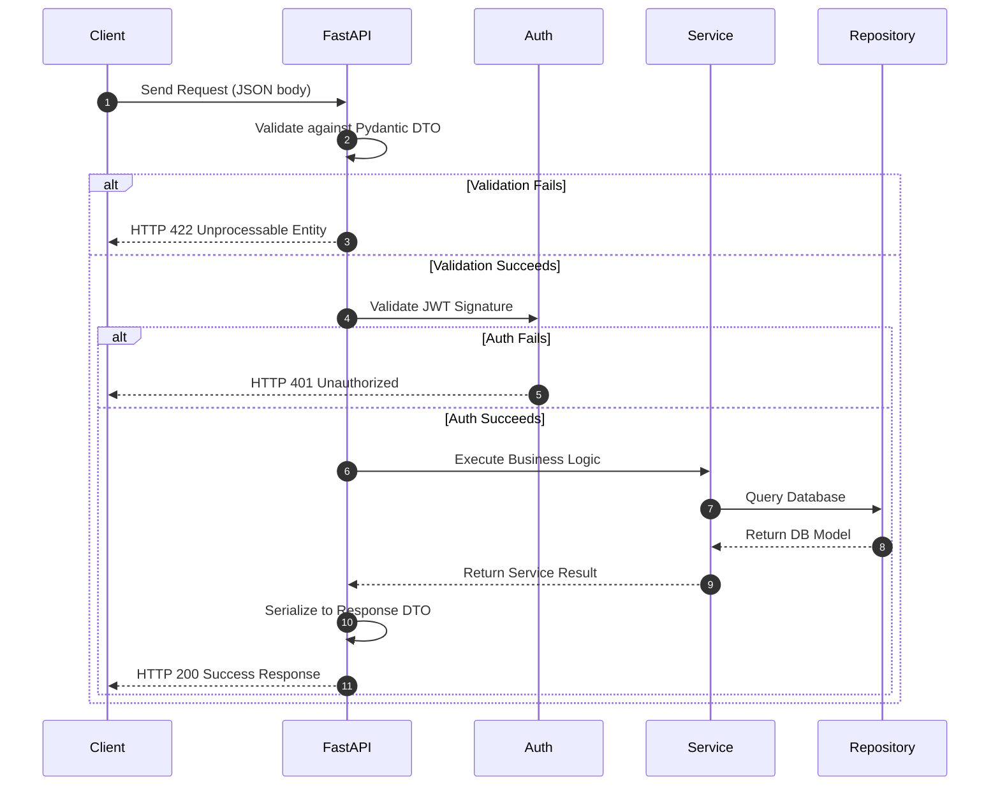

---

## Chapter 17: Frontend Architecture & UI Hierarchy

The React Single Page Application (SPA) is built around a component hierarchy designed for responsive workspaces.

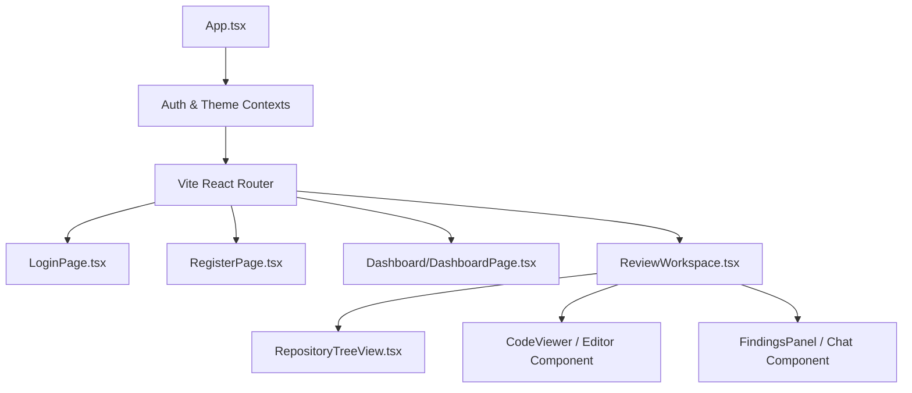

---

## Chapter 18: Security & OWASP Alignment

The platform is designed around security best practices:

* **SQL Injection Prevention**: Built entirely on SQLAlchemy 2.0. Queries are parameterized, separating query logic from user-provided inputs.
* **XSS Prevention**: React automatically escapes rendering values. Markdown rendering is sanitized using dedicated parser configurations.
* **Zip-Bomb Mitigation**: The extraction pipeline reads ZIP contents in chunks, checking sizes before writing to disk.
* **Least Privilege Access**: Subprocesses for static analysis run with minimal user permissions, restricted to a sandbox workspace.

---

## Chapter 19: Performance Optimization & Caching

CodeInsight AI uses several performance optimization strategies:

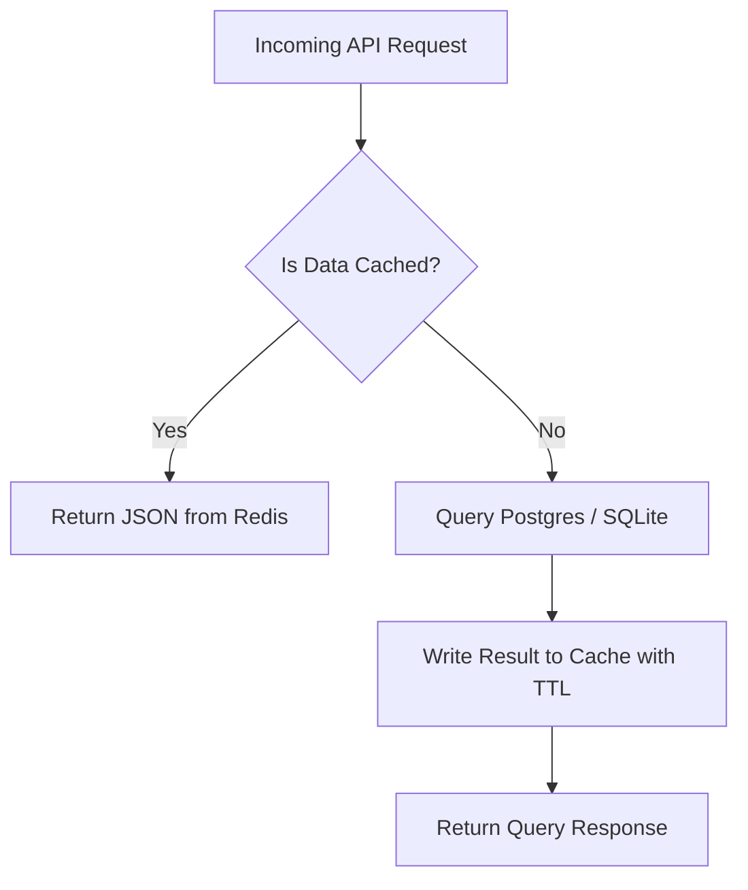

---

## Chapter 20: System Scalability & Infrastructure

The architecture can be scaled horizontally to handle increased workloads.

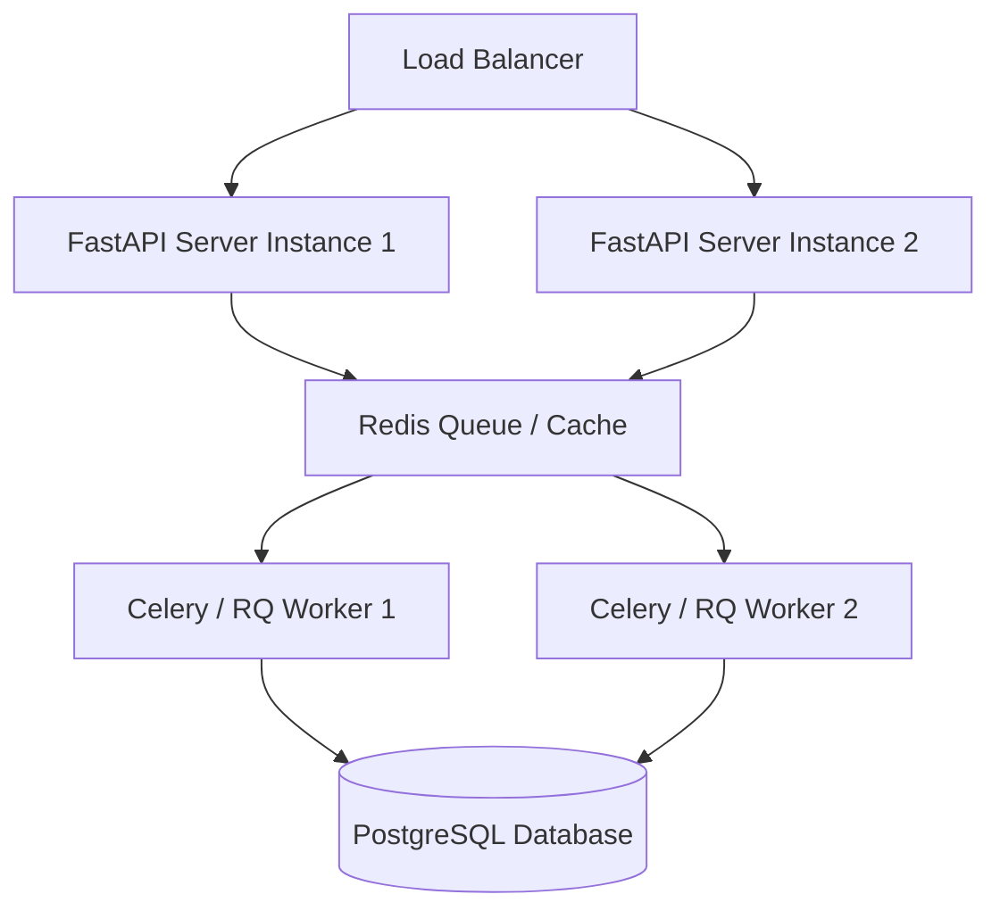

---

## Chapter 21: Design Patterns Applied

CodeInsight AI uses design patterns to maintain a clean codebase:

* **Repository Pattern**: Abstracts database queries, decoupling business logic from ORM implementation.
* **Strategy Pattern**: Selects analyzers dynamically based on the file language.
* **Factory Pattern**: Spawns LLM providers based on environment settings.
* **Dependency Injection**: Injects database sessions and services, simplifying mocking in unit tests.

---

## Chapter 22: Algorithms & Big-O Complexity Analysis

This chapter analyzes the complexity of the platform's core operations:

* **Directory Traversal**: $O(N)$ time complexity, where $N$ is the number of files. Visited paths are tracked in a set to prevent infinite loops from symlinks.
* **Language Detection**: $O(1)$ time complexity, using a hash map lookup on file extensions.
* **Sliding Window Chunking**: $O(C)$ time complexity, where $C$ is the number of characters in a file.
* **Cosine Similarity Search**: $O(M \cdot D)$ time complexity, where $M$ is the number of chunks and $D$ is the vector dimension.

### Big-O Complexity Comparison Table

| Algorithm Module | Time Complexity (Average) | Time Complexity (Worst-Case) | Space Complexity |
| :--- | :--- | :--- | :--- |
| **Directory Traversal** | $O(N)$ | $O(N)$ | $O(N)$ |
| **Language Detection** | $O(1)$ | $O(1)$ | $O(1)$ |
| **Sliding Window Chunking** | $O(C)$ | $O(C)$ | $O(C)$ |
| **Vector Similarity Search** | $O(M \cdot D)$ | $O(M \cdot D)$ | $O(M \cdot D)$ |

---

## Chapter 23: Development Methodology & CI/CD Pipelines

The project uses Agile development and automated CI/CD pipelines.

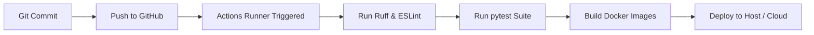

---

## Chapter 24: Testing & Quality Assurance Strategy

The testing strategy follows the **Test Pyramid** approach, focusing on unit and integration tests.

```
       ▲
      ╱ ╲      UI / End-to-End Tests (< 5%)
     ╱   ╲
    ╱     ╲    API Integration Tests (~ 25%)
   ╱       ╲
  ╱         ╲  Unit Tests (~ 70%)
 ─────────────
```

---

## Chapter 25: Logging, Auditing & Monitoring Infrastructure

Observability is built into the platform's core packages:

* **Structured Logging**: Log messages are formatted with timestamps, module names, and transaction IDs.
* **Health Checks**: Dedicated endpoints verify connection status to PostgreSQL and external LLM APIs.
* **Error Tracking**: Unhandled exceptions log complete tracebacks to assist in debugging.

---

## Chapter 26: Future Enhancements & Roadmap

The roadmap includes plans for more advanced analysis capabilities:

* **Agentic Review Workflows**: Multi-agent setups where specialized agents (such as security or performance agents) critique code and propose fixes.
* **IDE Integrations**: Extensions for VS Code and JetBrains to run analyses directly inside the editor.
* **Graph-RAG Implementation**: Replacing flat chunking with AST graphs to track complex dependencies and class hierarchies across files.

---

## Chapter 27: Conclusion & Technical Innovation Summary

`CodeInsight AI` demonstrates how static analysis and Large Language Models can be combined into a cohesive code review platform. By running deterministic linters alongside LLM reasoning, the system catches both formatting errors and complex logical flaws.

Its layered architecture, decoupled scanning pipeline, and database-backed vector retrieval establish a foundation that scales efficiently from local development to team-wide deployment. CodeInsight AI streamlines quality assurance, helping development teams maintain high standards without slowing down deployment velocity.
